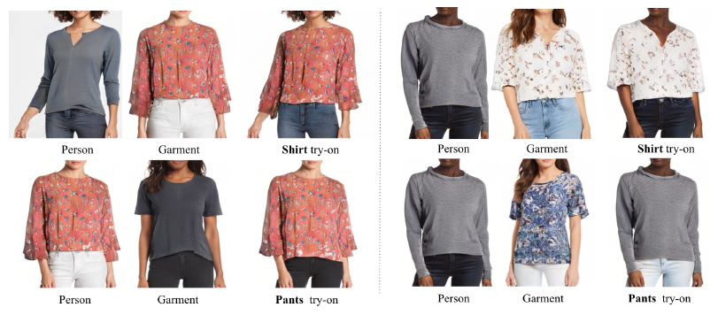
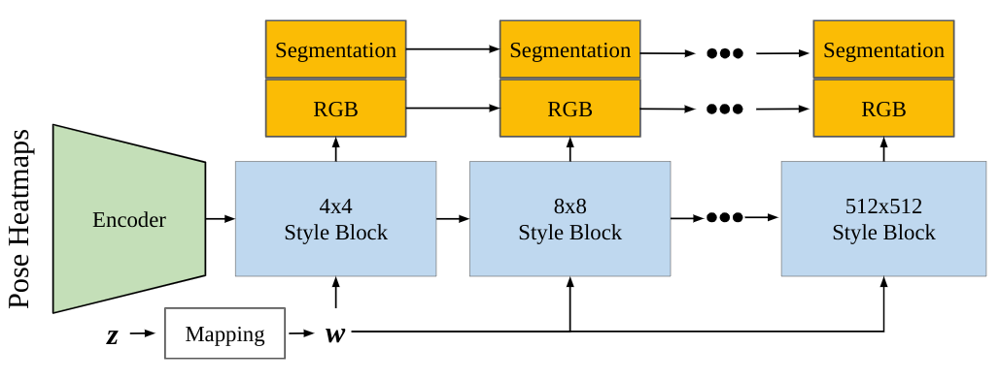
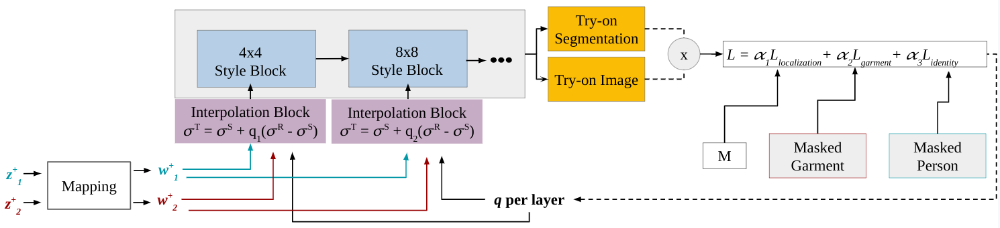
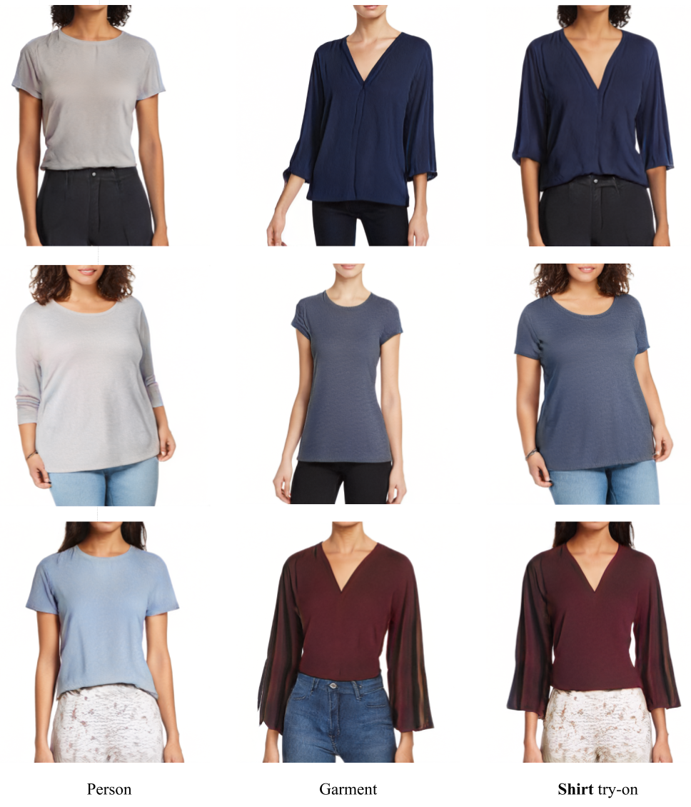
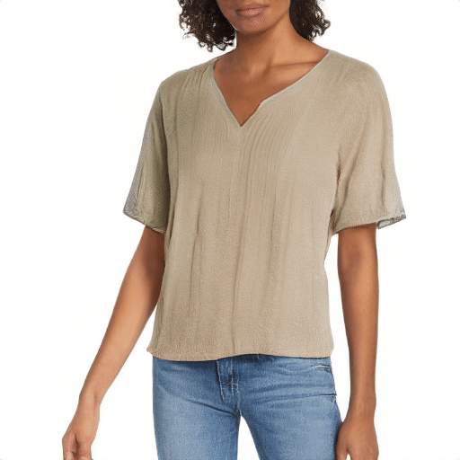
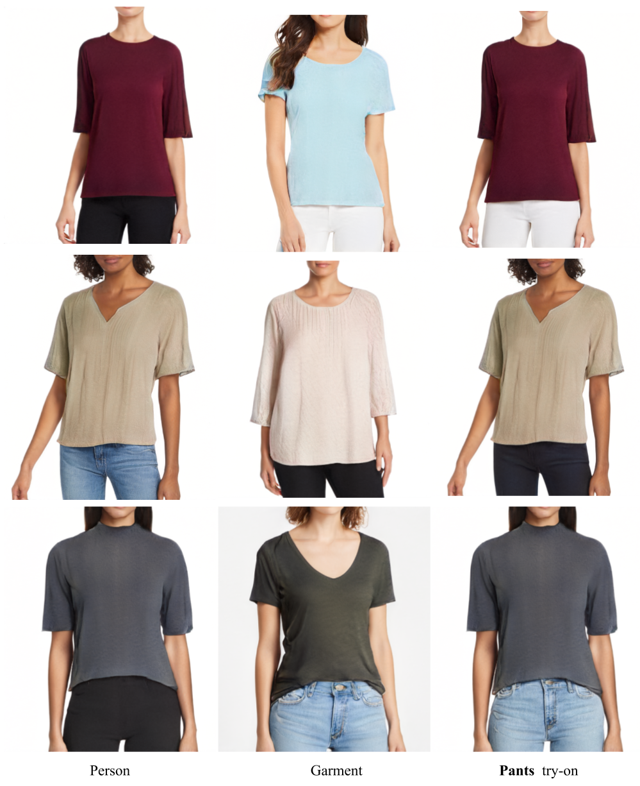
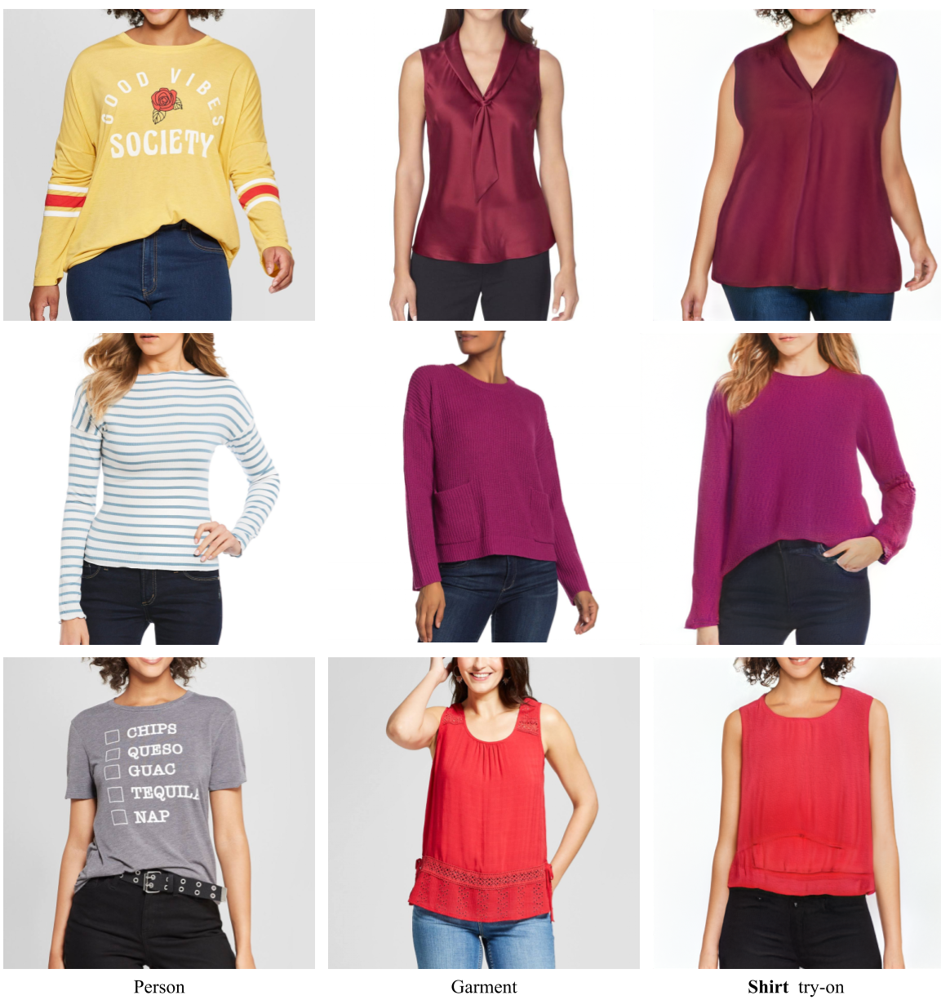
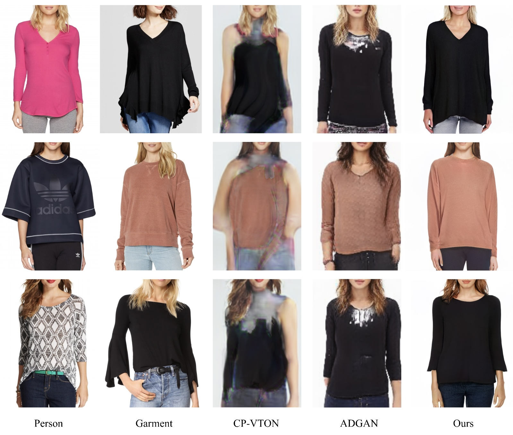

<h1 align="center">VOGUE: Try-On by StyleGAN Interpolation Optimization</h1>

<pre class="major">
 	<a href="https://katiemlewis.github.io/" target="_blank" class="authors">Kathleen M Lewis</a>1,2		<a href="https://www.linkedin.com/in/srivatsan-varadharajan-9a570818" target="_blank" class="authors">Srivatsan Varadharajan</a>1		<a href="https://sites.google.com/view/irakemelmacher/home" target="_blank" class="authors">Ira Kemelmacher-Shlizerman</a>1,3
  		1Google Research	2MIT CSAIL	 3University of Washington
</pre>

    <code><a href="static_files/resources/VOGUE-virtual-try-on.pdf" target="_blank" class="button big wide smooth-scroll-middle"> Paper </a> </code>
    &nbsp;<code><a href="http://arxiv.org/abs/2101.02285" target="_blank" class="button big wide smooth-scroll-middle">arXiv </a> </code>
    &nbsp;<code><a href="https://youtu.be/AWd7x_3GaZk" target="_blank" class="button big wide smooth-scroll-middle"> Video </a> </code>
    &nbsp;<code><a href="demo_rewrite.html" target="_blank" class="button big wide smooth-scroll-middle"> Interactive Example</a> </code>

 

	

Figure 1: VOGUE is a StyleGAN interpolation optimization algorithm for photo-realistic try-on. Top: shirt try-on automatically synthesized by our method in two different examples. Bottom: pants try-on synthesized by our method. Note how our method preserves the identity of the person while allowing high detail garment try on.

### Abstract

Given an image of a target person and an image of another person wearing a garment, we automatically generate the target person in the given garment. At the core of our method is a pose-conditioned StyleGAN2 latent space interpolation, which seamlessly combines the areas of interest from each image, i.e., body shape, hair, and skin color are derived from the target person, while the garment with its folds, material properties, and shape comes from the garment image. By automatically optimizing for interpolation coefficients per layer in the latent space, we can perform a seamless, yet true to source, merging of the garment and target person. Our algorithm allows for garments to deform according to the given body shape, while preserving pattern and material details. Experiments demonstrate state-of-theart photo-realistic results at high resolution (512 x 512).

### VOGUE Method

	
We train a pose-conditioned StyleGAN2 network that outputs RGB images and segmentations.

	
	
After training our modified StyleGAN2 network, we run an optimization method to learn interpolation coefficients for each style block. These interpolation coefficients are used to combine style codes of two different images and semantically transfer a region of interest from one image to another. This method can be used for generated StyleGAN2 images or on real images by first projecting the real images into the latent space.  

	

Figure 2: The try-on optimization setup illustrated here takes two latent codes z+1 and z+2 (representing two input images) and a pose heatmap as input into a pose-conditioned StyleGAN2 generator (gray). The generator produces the try-on image and its corresponding segmentation by interpolating between the latent codes using the interpolation-coefficients <i>q</i>. By minimizing the loss function over the space of interpolation coefficients, we are able to transfer garment(s) <i>g</i> from a garment image <i>Ig</i>, to the person image <i>Ip</i>.

### Generated Image Try-On

VOGUE can transfer garments between different poses and body shapes. It preserves garment details (shape, pattern, color, texture) and person identity (hair, skin color, pose). 

	
#### Shirt Try-On
With VOGUE, the same person can try on shirts of different styles (above). The identity of the person is preserved. When transferring a shorter garment or a different neckline, VOGUE is able to synthesize skin that is realistic and consistent with identity (below). 

<table>
	<tbody>
	<tr>
		<td>
			

				 
			

		</td>
		<td>
			

				
			

		</td>
	</tr>
	</tbody>
</table>

 

Different people can also try on the same shirt (below). The characteristics of the shirt are preserved across different poses and people.

#### Pants Try-On

<table>
	<tbody>
	<tr>
		<td>
			

				
			

			

				 
			

		</td>
		<td colspan="1" rowspan="3">
			

				
			

		</td>
	</tr>
	</tbody>
</table>

	
	

### Projected Image Try-On

Virtual try-on between two real images is possible by first projecting the two images into the StyleGAN Z+ latent space. Improving projection is an active area of research.

#### Shirt Try-On

#### Comparison with SOTA

	<small>
		Wang, Bochao, et al. "Toward characteristic-preserving image-based virtual try-on network." Proceedings of the European Conference on Computer Vision (ECCV). 2018.  
		 Men, Yifang, et al. "Controllable person image synthesis with attribute-decomposed gan." Proceedings of the IEEE/CVF Conference on Computer Vision and Pattern Recognition. 2020.	
	</small>

### Acknowledgements

We thank Edo Collins, Hao Peng, Jiaming Liu, Daniel Bauman, and Blake Farmer for their support of this work.

 
 

Feel free to ask any questions, open a PR if you feel something can be done differently!

<h2 align="center">🌟Star this repository🌟</h2>

Created by <a href="https://github.com/Charmve">Charmve</a> & <a href="https://github.com/MaiweiAI">maiwei.ai</a> Community | Deployed on <a href="https://www.kaggle.com/yidazhang07/bridge-cracks-image">Kaggle</a>

